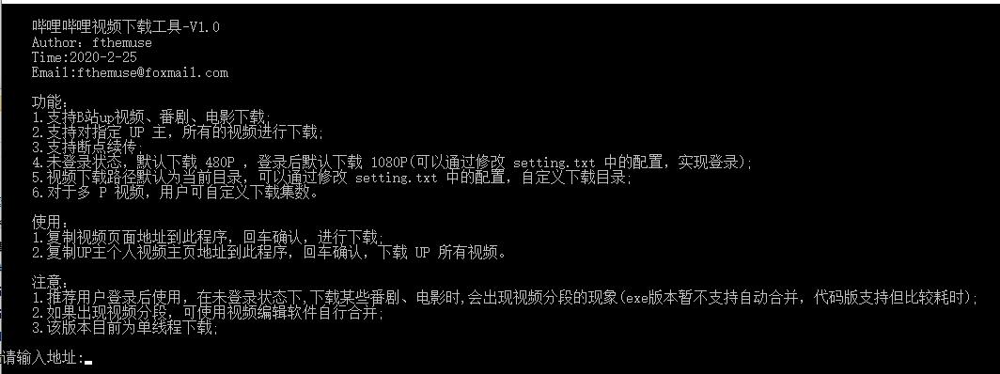
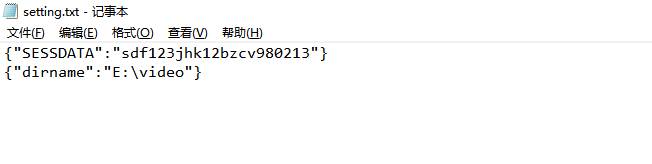

# BilibiliVideoDownload
B站视频、番剧、电影爬取

### 功能

1. 输入B站视频播放地址，开始下载
2. 支持断点续传,显示当前下载进度和速度
3. 未登录状态下，只能下载480p，登录后默认分辨率为1080p，用户可设置 Cookie
4. 支持番剧、电影下载
5. 支持输入 up 主主页 url，对该up所有视频进行下载
6. 此代码为单线程爬取


### 注意

1. 推荐用户登录后使用，在未登录状态下,下载某些番剧、电影时,会出现视频分段的现象(exe版本暂不支持自动合并，代码版支持但比较耗时);
2. 如果出现视频分段，可使用视频编辑软件自行合并;
3. 该版本目前为单线程下载。


### 运行环境

```
Version: Python3
```


### 安装依赖库

```
pip3 install -r requirements.txt
```


### 运行时截图




### Setting.text设置

例如：

